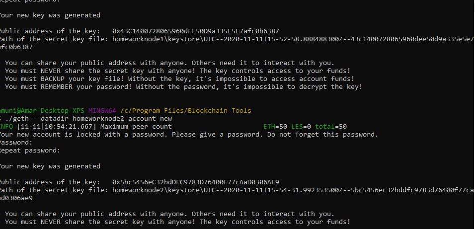
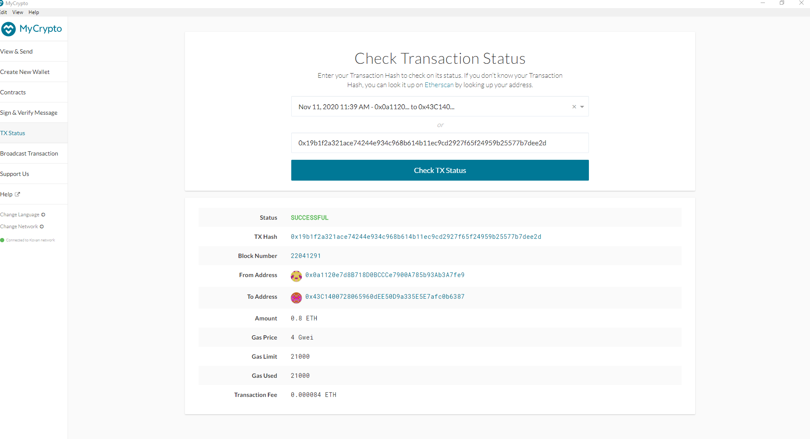
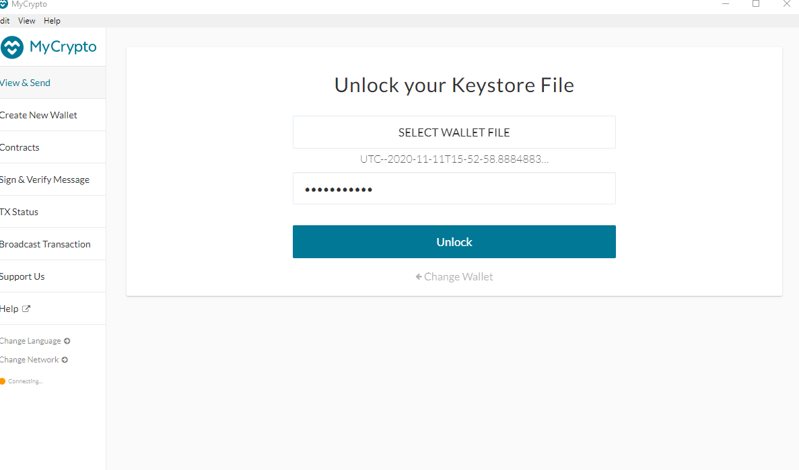
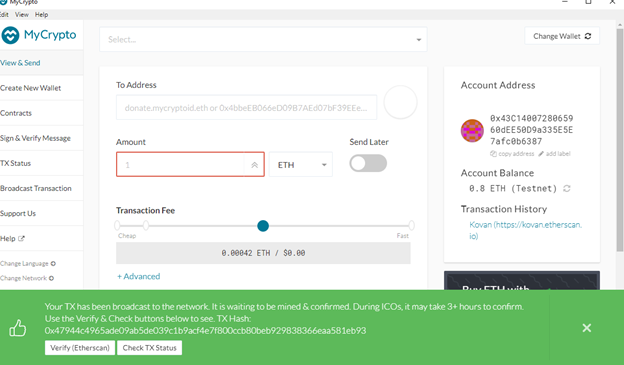
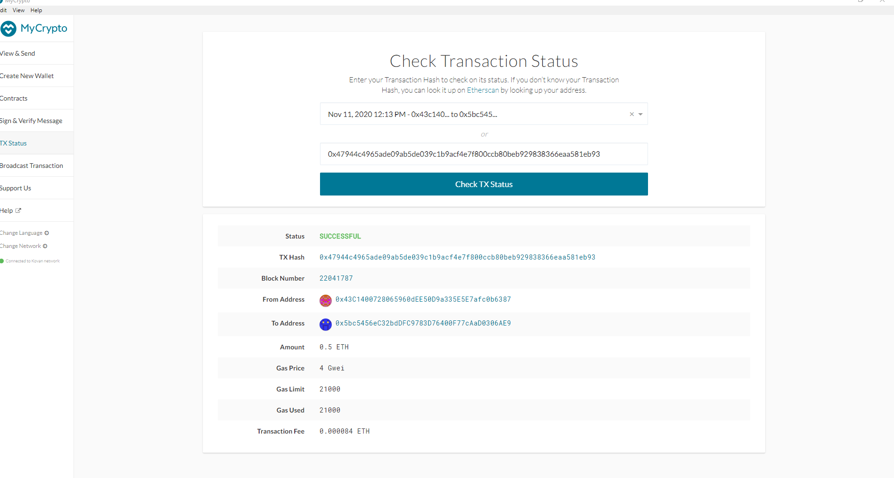

# Running a Proof of Authority Blockchain
## Submitted by Amar Munipalle

# Introduction to Proof of Authority ('PoA') algorithm and use case

Attached medium article summarizes succintly the concept of a PoA network.
* [PoA and Clique Algorithm](https://medium.com/@casinesque/clique-algorithm-proof-of-authority-consensus-be574a2d1af3)  

Per medium "concept of permissioned or consortium blockchain as a particular kind of blockchain where the participants of the systems need a sort of permission in order to join the network. Imagine this as a set of known companies that are building up a closed blockchain environment in order to exchange assets among them. We can’t let anyone enter in our network since our market and environment is closed and must be kept under control."

# Use Case

ZBank is interested in exploring what blockchain technology can do for them and their customers. This implies a trusted 'offline' network amongst its employees and customers. Given it is a 'closed environment' 'outsiders' will not be allowed into this network which will be restricted as above.

Given the above dynamics some of the risks associated with an open network like a Distributed Denial of Service attack are reduced and the focus of the algorithm is different. This permits us to nominate two nodes as 'miners' / 'validators' and rotate block validation duties; as we know for sure that outsiders are not allowed.

Details of the clique algorithm and protection agains Byzantine ('BFT') users by relying on Ethereum's GHOST protocol are outlined.

# How frequently will our leader broadcast

We have created a block with 2 nodes. So each node will broadcast N/2+1 i.e. for every two blocks. Stated differently they will take turns.
#### (2/2+1)=2
If this network was compromised with 2 Byzantine nodes we will still have the 'original' nodes broadcast every 3 blocks
#### (4/2+1)=3

## Instructions

1. Given closed environment, we have to generate two new nodes with new account addresses that will serve as our pre-approved sealer addresses. These nodes are called

    * Create accounts for two nodes for the network with a separate `datadir` for each using `geth`.
        * ./geth --datadir homeworknode1 account new
        * ./geth --datadir homeworknode2 account new

2. The public / private keys are stored in
   

3. Pre-fund nodes
        * homeworknode1 is pre-funded from the kovan testnetwork. This is important as there are no block rewards in PoA
    This has been funded from a prior kovan faucet

    

4. Next, generate your genesis block.

    * Run `puppeth`, named network 'homework' and chose PoA clique for generating genesis block.

    * Choose the `Clique (Proof of Authority)` consensus algorithm.

    * Public keys of homeworknode1 and homeworknode2 are used to seal closed blockchain.

    * Same accounts are chosed for the pre-fund. There are no block rewards in PoA, so you'll need to pre-fund.

    * Chose `no` for pre-funding the pre-compiled accounts (0x1 .. 0xff) with wei. This keeps the genesis cleaner.

    * Rest of the prompts used default values.

    * Export genesis configurations. Key file `homework.json`.

5. With the genesis block creation completed, we will now initialize the nodes with the genesis' json file.

    * Using `geth`, initialize each node with the new `homework.json`.
        * ./geth --datadir homeworknode1 init homework.json
        * ./geth --datadir homeworknode2 init homework.json

6. Now the nodes can be used to begin mining blocks.

    * Run the nodes in separate terminal windows with the commands:
        *  ./geth --datadir node1 --unlock "0x43C1400728065960dEE50D9a335E5E7afc0b6387" --mine --rpc --allow-insecure-unlock
        *  ./geth --datadir node2 --unlock "0x5bc5456eC32bdDFC9783D76400F77cAaD0306AE9" --mine --port 30304 --bootnodes "enode://f837e6a3416b5f6c0afe31f00d6201117cfa5de335ec4aeb6871071c43cfee99373a641a978e492b443f20cd44bc21b6ba190562f485cad0c4e259385e94fee6@127.0.0.1:30303" --ipcdisable --allow-insecure-unlock
    * **NOTE:** Type your password and hit enter - even if you can't see it visually!
    The second node is initiating an RPC call to the first node

7. Private PoA blockchain should now be running!

8. With both nodes up and running, the blockchain can be added to MyCrypto for testing.

    * Open the MyCrypto app, then click `Change Network` at the bottom left:

    

    * Click "Add Custom Node", then add the custom network information that you set in the genesis.

    * Make sure that you scroll down to choose `Custom` in the "Network" column to reveal more options like `Chain ID`:

    

    The chain ID of 340 is chosen to not conflict with any previous chain IDs

    * Type `ETH` in the Currency box.
    
    * In the Chain ID box, type the chain id you generated during genesis creation.

    * In the URL box type: `http://127.0.0.1:8545`.  This points to the default RPC port on your local machine.

    * Finally, click `Save & Use Custom Node`. 

9. After connecting to the custom network in MyCrypto, it can be tested by sending money between accounts.

    * Select the `View & Send` option from the left menu pane, then click `Keystore file`.

    

    * On the next screen, click `Select Wallet File`, then navigate to the keystore directory inside your Node1 directory, select the file located there, provide your password when prompted and then click `Unlock`.

    * This will open your account wallet inside MyCrypto. 
    
    * Final Balances and Transactions are shown.   

    * In the `To Address` box, type the account address from Node2 (0x5bc5456eC32bdDFC9783D76400F77cAaD0306AE9), then fill in an arbitrary amount of ETH (0.5):

    * Confirm the transaction by clicking "Send Transaction", and the "Send" button in the pop-up window.  

    

    * Click the `Check TX Status` when the green message pops up, confirm the logout:

    

    * You should see the transaction go from `Pending` to `Successful` in around the same blocktime you set in the genesis.

## Congratulations, you successfully created your own private blockchain! Welcome to ZBank!
## Refer to folder NetworkDetails and NodeDetails to retrieve your keys!